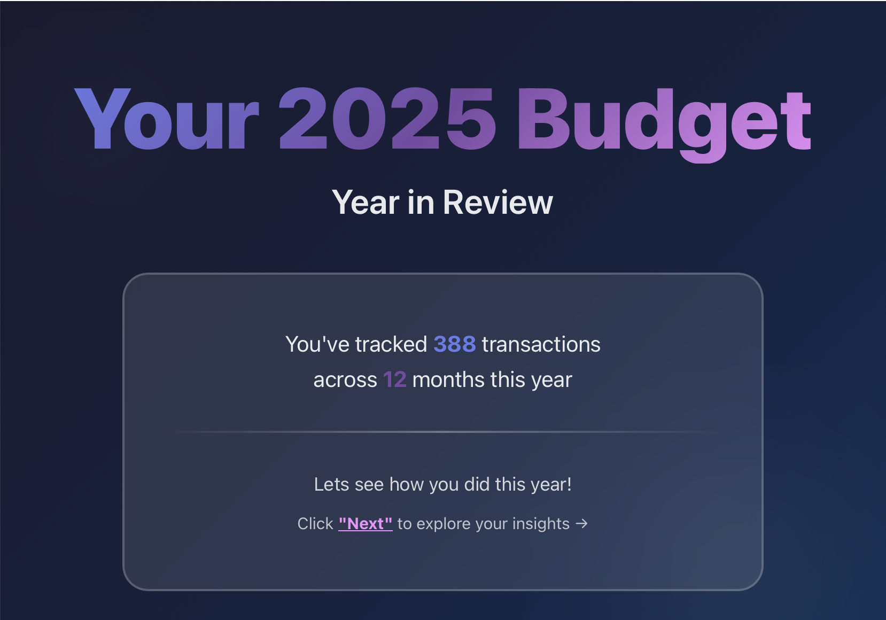

# Actual Budget 2025 Wrapped

A beautiful year-in-review application for your Actual Budget data, styled like Spotify Wrapped. View your income, expenses, top categories, transaction patterns, and more with stunning visualizations and animations.

[](https://wrapped.actualbudget.org)

> ⚠️ **Note**: This project was vibe coded - it was built for fun and to scratch a personal itch. Don't expect production-grade code quality, extensive error handling, or perfect architecture. It works, but it's not perfect. Use at your own discretion! 😅

## Features

- 📊 **Comprehensive Statistics**: Income vs expenses, top categories, top payees, transaction statistics
- 📅 **Calendar Heatmap**: GitHub-style contribution graph showing transaction frequency
- 📈 **Beautiful Charts**: Interactive charts powered by Recharts
- 🎨 **Spotify Wrapped Style**: Vibrant gradients, bold typography, smooth animations
- 🔒 **Privacy First**: All processing happens in your browser - your data never leaves your device
- ⌨️ **Keyboard Navigation**: Navigate with arrow keys (← →)
- 📱 **Responsive Design**: Works on desktop and mobile devices
- 🧪 **Well Tested**: Unit tests with Vitest and E2E tests with Playwright
- ⚙️ **Flexible Filtering**: Toggle to include/exclude off-budget transactions, on-budget transfers, and cross-account transfers
- 💱 **Currency Override**: Change currency display without modifying your budget data
- 🔄 **Smart Transfer Labeling**: Transfers are automatically labeled with destination account names (e.g., "Transfer: Savings Account") in both categories and payees lists, instead of showing as uncategorized or unknown

See [CHANGELOG.md](CHANGELOG.md) for a detailed history of changes.

## Prerequisites

- Node.js 20+ and Yarn 4.12.0+
- An exported Actual Budget file (zip format)

## Architecture

This application runs entirely in the browser with no backend server required. The app:

- Uses **sql.js** (WebAssembly SQLite) to read the Actual Budget database directly in the browser
- Processes data client-side using **JSZip** to extract the database from the exported zip file
- Requires no server, no API calls, and no internet connection after initial load
- All your financial data stays completely private on your device

## Getting Started

### Installation

1. Clone or download this repository
2. Install dependencies:

```bash
yarn install
```

### Exporting Your Budget

Before you can use the app, you need to export your budget from Actual Budget:

1. Open Actual Budget
2. Go to **Settings → Advanced → Export budget**
3. Save the exported `.zip` file to your computer

### Running the Application

Start the development server:

```bash
yarn dev
```

The app will open at `http://localhost:5173` (or the next available port).

### Building for Production

```bash
yarn build
```

The built files will be in the `dist` directory and can be deployed to any static hosting service.

### Preview Production Build

Preview the production build locally:

```bash
yarn preview
```

## Usage

1. **Upload Your Budget**: Click "Choose File" and select your exported Actual Budget `.zip` file
2. **Wait for Processing**: The app will extract and process your 2025 budget data (this happens entirely in your browser)
3. **Adjust Settings** (optional): Click the settings menu (☰) in the top-right corner to:
   - Include/exclude off-budget transactions
   - Include/exclude budgeted transfers (transfers between on-budget and off-budget accounts)
   - Include all transfers (includes all transfer types, including between two on-budget accounts)
   - Override currency display
4. **Navigate Through Pages**: Use the Next/Previous buttons or arrow keys (← →) to navigate through the wrapped pages

## Technology Stack

- **React 19** with TypeScript
- **Vite 7** for build tooling
- **Framer Motion** for animations
- **Recharts** for data visualization
- **sql.js** for in-browser SQLite database processing
- **JSZip** for zip file extraction
- **date-fns** for date utilities

## Development

### Testing

Run unit tests:

```bash
yarn test
```

Run tests in watch mode:

```bash
yarn test:watch
```

Run E2E tests:

```bash
yarn test:e2e
```

### Linting

Format and lint code:

```bash
yarn lint
```

Check linting without fixing:

```bash
yarn lint:check
```

### Type Checking

The build script automatically runs TypeScript type checking. To check types manually:

```bash
npx tsc --noEmit
```

## Privacy & Security

This application is designed with privacy as a core principle:

- **No Server Required**: All processing happens locally in your browser
- **No Data Transmission**: Your budget file is never sent to any server
- **No Tracking**: No analytics, no cookies, no tracking scripts
- **Open Source**: You can audit the code yourself

Your exported budget file is loaded into memory, processed, and never stored permanently. Once you close the browser tab, the data is cleared.

## Troubleshooting

### File Upload Issues

- Ensure you're uploading a `.zip` file exported from Actual Budget
- The file must contain a `db.sqlite` file inside
- Check browser console for detailed error messages

### Missing Data

- Ensure you have transactions in 2025
- Verify your exported budget file is complete and not corrupted
- Try re-exporting your budget from Actual Budget

### Chart Not Displaying

- Check browser console for errors
- Ensure you have data for the selected year (2025)
- Try uploading your budget file again

### Performance Issues

- Large budget files may take longer to process
- The app processes data in your browser, so performance depends on your device
- For very large budgets, consider closing other browser tabs to free up memory

## License

This project is licensed under the MIT License - see the [LICENSE](LICENSE) file for details.

## Credits

Built for Actual Budget users who want to see their financial year in review. Inspired by Spotify Wrapped.
